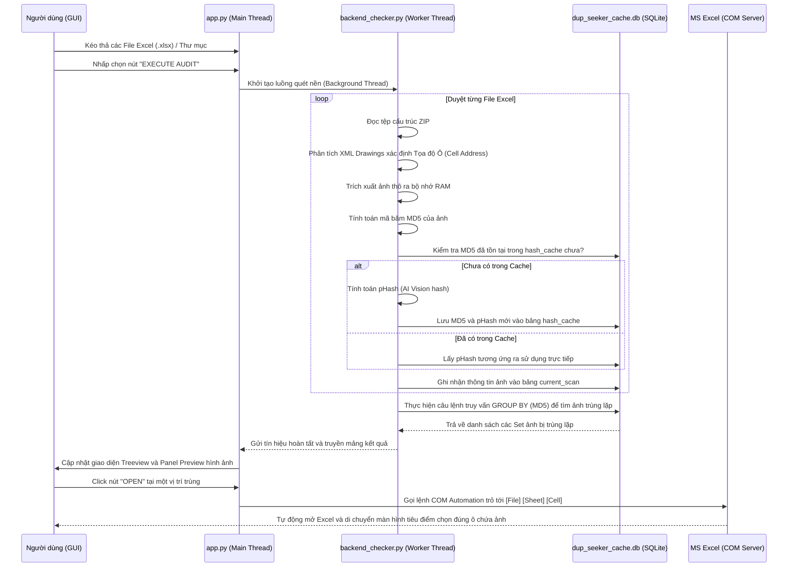

# 📂 DUP-SEEKER: Comprehensive Project Structure & Technical Architecture

Tài liệu này cung cấp sơ đồ cây thư mục hoàn chỉnh, mô tả chi tiết vai trò của từng mô-đun mã nguồn, cấu trúc cơ sở dữ liệu SQLite cache, cơ chế đóng gói PyInstaller và các luồng tương tác luồng dữ liệu (Dataflow) phục vụ cho việc bảo trì, tối ưu hóa hoặc mở rộng dự án DUP-SEEKER.

---

## 1. 🗂️ Sơ đồ cấu trúc cây thư mục (Directory Tree)

```text
check_dup_img_excel/
│
├── .agent/                    # [Hệ thống] Tài nguyên/Kỹ năng cấu hình cho AI Agent
│   └── skills/                # Thư viện UI/UX chuyên sâu phục vụ thiết kế
│
├── assets/                    # [Tài nguyên] Chứa bộ nhận diện thương hiệu
│   ├── app.ico                # Icon chuẩn Windows dùng cho Window Title & PyInstaller Compiler
│   └── app.png                # Phiên bản PNG độ phân giải cao dùng cho hiển thị / Preview
│
├── DATA/                      # [Thư mục Dữ liệu] Chứa các file Excel (.xlsx) đầu vào để test quét
│   └── .gitkeep               # Giữ thư mục rỗng trong Git
│
├── OUTPUT/                    # [Thư mục Kết quả] Lưu các báo cáo kiểm tra trùng lặp xuất ra dạng Excel
│   └── .gitkeep               # Giữ thư mục rỗng trong Git
│
├── dist/                      # [Bản phân phối] Sản phẩm sau khi biên dịch bằng PyInstaller
│   └── DUP-SEEKER/            # Thư mục thực thi Windows (được ZIP lại để gửi cho người dùng)
│       ├── DUP-SEEKER.exe     # Tệp thực thi chính chạy phần mềm không cần cài Python
│       └── _internal/         # Thư mục nội bộ chứa DLLs, CustomTkinter, pillow & tkdnd binaries
│
├── build/                     # [Tạm thời] Thư mục chứa file log/cache trung gian của PyInstaller
│
├── app.py                     # [Lõi Giao diện & Điều khiển] Mã nguồn chính quản lý CustomTkinter GUI,
│                              # xử lý sự kiện Drag & Drop, liên kết COM Excel và điều phối quét
│
├── backend_checker.py         # [Lõi Logic Quét] Chứa các lớp xử lý thuật toán phân tích tệp Excel,
│                              # trích xuất XML Drawing, giải mã ZIP ảnh và so khớp mã hash
│
├── dup_seeker_cache.db        # [Cơ sở dữ liệu SQLite] Lưu bộ đệm băm (hash cache) để tăng tốc quét
│
├── DUP-SEEKER.spec            # [Biên dịch] File cấu hình biên dịch PyInstaller cho DUP-SEEKER
├── AuditorElite.spec          # [Biên dịch] File cấu hình biên dịch PyInstaller cho phiên bản Elite
│
├── .gitignore                 # Cấu hình bỏ qua các tệp tin build, cache (.db), zip, data thử nghiệm
├── README.md                  # Hướng dẫn sử dụng và giới thiệu tổng quan ứng dụng (SaaS Style)
└── PROJECT_STRUCTURE.md       # [Tài liệu này] Đặc tả kỹ thuật chi tiết cấu trúc hệ thống
```

---

## 2. 🧬 Chi tiết các thành phần chính (Core Components)

### A. Lõi Logic Giao diện (`app.py`)
Mã nguồn điều khiển toàn bộ tương tác người dùng, tích hợp các công nghệ hệ thống:
*   **`DuplicateApp(ctk.CTk, TkinterDnD.DnDWrapper)`**: Lớp đối tượng chính kế thừa từ CustomTkinter và bộ thư viện Drag & Drop để nhận diện kéo thả tệp Excel.
*   **Windows Process Shell Integration**: Sử dụng thư viện `ctypes` để gọi hàm API Windows `SetCurrentProcessExplicitAppUserModelID`. Điều này buộc hệ điều hành Windows nhận diện tiến trình là một phần mềm độc lập, hiển thị chính xác icon dưới Taskbar.
*   **Delayed Zoom Loop**: Để tránh xung đột với luồng đo lường DPI của CustomTkinter (khiến cửa sổ tự động thu nhỏ lại sau khi maximize), lệnh phóng to được chuyển sang dạng tác vụ trễ: `self.after(150, lambda: self.state("zoomed"))`.
*   **Excel COM Automation**: Sử dụng thư viện `win32com.client.Dispatch` kết nối với ứng dụng Excel đang chạy hoặc tạo mới. Kích hoạt workbook, lựa chọn trang tính mục tiêu (`active sheet`), và thực hiện bôi đen/chọn ô (`Range().Select()`) để dẫn người dùng đến vị trí ảnh trùng.

### B. Lõi Xử lý Backend (`backend_checker.py`)
Hệ thống xử lý tệp Excel dựa trên cấu trúc OpenXML:
*   **Excel as a ZIP File**: Đọc cấu trúc tệp `.xlsx` bằng thư viện `zipfile` mà không cần giải nén tệp ra ổ cứng, tối ưu tốc độ đọc/ghi I/O.
*   **XML Parser**: Sử dụng `xml.etree.ElementTree` phân tích các thẻ liên kết để định vị tọa độ ảnh:
    1.  `xl/workbook.xml` lấy tên các trang tính.
    2.  `xl/worksheets/_rels/sheet{n}.xml.rels` tìm khóa liên kết đến bảng vẽ `drawing{n}.xml`.
    3.  `xl/drawings/drawing{n}.xml` phân tích tọa độ neo (`twoCellAnchor`, `oneCellAnchor`) để xác định tọa độ ô (Column, Row) bắt đầu của bức ảnh.
*   **Media Hash Engine**: Truy cập `xl/media/` để lấy dữ liệu ảnh thô và băm nhanh bằng thuật toán `MD5` làm khóa định danh chính. Nếu ảnh bị nghi vấn, thuật toán băm nhận diện `pHash` (thư viện `imagehash`) sẽ được kích hoạt để phân tích độ tương đồng điểm ảnh.

---

## 3. 🗄️ Thiết kế Cơ sở Dữ liệu Cache (`dup_seeker_cache.db`)

Để tối ưu hóa hiệu năng cấp độ Big Data khi quét hàng nghìn file báo cáo lớn, hệ thống lưu trữ kết quả băm ảnh vào SQLite cục bộ thay vì tính toán lại:

```sql
-- 1. Bảng hash_cache: Lưu bộ nhớ vĩnh viễn (md5 -> phash) để tránh giải nén và băm lại
CREATE TABLE IF NOT EXISTS hash_cache (
    md5 TEXT PRIMARY KEY,
    phash TEXT
);

-- 2. Bảng current_scan: Lưu trữ danh sách toàn bộ ảnh tìm thấy trong đợt quét hiện tại
CREATE TABLE IF NOT EXISTS current_scan (
    id INTEGER PRIMARY KEY AUTOINCREMENT,
    full_path TEXT,      -- Đường dẫn tuyệt đối của file Excel chứa ảnh
    file_name TEXT,      -- Tên file Excel ngắn gọn
    sheet TEXT,          -- Tên Sheet chứa ảnh
    cell TEXT,           -- Địa chỉ ô chứa ảnh (ví dụ: B12)
    m_path TEXT,         -- Đường dẫn nội bộ của ảnh trong file zip (ví dụ: xl/media/image1.png)
    md5 TEXT,            -- Mã băm MD5 của ảnh thô
    phash TEXT,          -- Mã băm cảm nhận pHash phục vụ AI so khớp
    pic_name TEXT        -- Tên vẽ (Shape Name) của ảnh trong Excel
);

-- 3. Chỉ mục tối ưu hóa tốc độ tìm kiếm và nhóm trùng lặp
CREATE INDEX IF NOT EXISTS idx_md5 ON current_scan(md5);
CREATE INDEX IF NOT EXISTS idx_phash ON current_scan(phash);
```

---

## 4. 🎛️ Luồng Chuyển tiếp Dữ liệu (State & Dataflow)



---

## 5. 📦 Quy chuẩn Cấu hình Đóng gói (.spec File)

Các tệp cấu hình `.spec` (`DUP-SEEKER.spec` và `AuditorElite.spec`) được tối ưu hóa đặc biệt cho PyInstaller:
*   **`datas`**: Đính kèm trực tiếp thư mục `assets` vào gói ứng dụng thực thi.
*   **`datas (site-packages)`**: Đính kèm tường minh thư mục chứa mã nguồn của `customtkinter` và `tkinterdnd2` để ngăn lỗi thiếu thư viện giao diện khi chạy trên máy tính khách.
*   **`hiddenimports`**: Đính kèm tường minh `win32com`, `win32com.client`, `pythoncom` và `win32api` để đảm bảo hệ thống COM Automation mở rộng của Excel hoạt động ổn định trên file `.exe` đóng gói của người dùng.
*   **`console=False`**: Ẩn hoàn toàn cửa sổ dòng lệnh đen (Command Prompt) khi người dùng khởi động phần mềm, tạo cảm giác chuyên nghiệp.
*   **`icon=['assets\\app.ico']`**: Tích hợp trực tiếp icon thương hiệu vào tệp tin thực thi DUP-SEEKER.exe.
