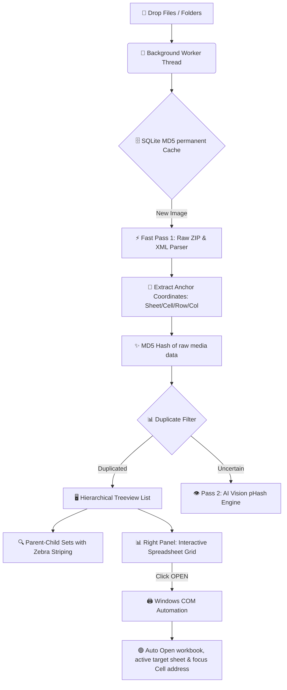

# 🚀 DUP-SEEKER: Premium Excel Image Integrity Suite

> [🇺🇸 English Version](#-english-version) | [🇻🇳 Phiên bản Tiếng Việt](#-phien-ban-tieng-viet)

---

## 📸 System Workflow / Quy trình Hoạt động Hệ thống



---

## 🇺🇸 ENGLISH VERSION

**DUP-SEEKER** is an Enterprise-Grade Desktop solution designed to automate duplicate image auditing across bulk Excel reports (`.xlsx`). It guarantees absolute data integrity in corporate technical documents.

### 🌟 Core Excellence (The Best of DUP-SEEKER)

*   **🔌 COM Deep-Linking & Auto-Focus:** Rather than just opening the file, DUP-SEEKER hooks directly into **Microsoft Excel** using Windows COM interfaces. Upon clicking **`OPEN`**, it dynamically activates the workbook, switches to the exact **Sheet**, and **selects & scroll-focuses** on the target **Cell Address** containing the duplicate image.
*   **⚡ Hyper-Speed Double-Hash Engine:** Integrates a dual băm image network (**MD5 + AI Vision pHash**) backed by a **permanent SQLite cache database**. It processes thousands of images in seconds without duplicate calculations.
*   **💎 Elite Corporate UI/UX:** Built on CustomTkinter with a premium Slate-Blue palette. Features:
    *   **Zebra-striped Hierarchical Treeview** with capped dynamic column width (`380px`) to prevent long filenames from breaking the layout.
    *   **Right Panel Spreadsheet Grid Table** showing all occurrences in a clean cell-bordered table with immediate action buttons.
    *   **Taskbar Icon Sync & DPI Maximization Fix** ensuring native Windows integration on startup.

---

### 🛠️ Installation & Usage Guide

> [!NOTE]
> **No installation is required!** DUP-SEEKER is fully portable.

#### Option 1: Run Pre-compiled Standalone EXE (For End-Users)
1. Download and extract **`DUP-SEEKER_v2.1_Final.zip`**.
2. Double-click **`dist/DUP-SEEKER/DUP-SEEKER.exe`** to launch instantly.

#### Option 2: Run from Python Source (For Developers)
1. Install required library dependencies:
   ```bash
   pip install customtkinter pillow tkinterdnd2-universal imagehash xlsxwriter pywin32
   ```
2. Launch the application:
   ```bash
   python app.py
   ```

---

## 🇻🇳 PHIÊN BẢN TIẾNG VIỆT

**DUP-SEEKER** là một giải pháp phần mềm Desktop chuyên dụng cấp doanh nghiệp giúp tự động hóa quá trình quét, phát hiện và kiểm tra ảnh trùng lặp trong hàng loạt báo cáo Excel (`.xlsx`), bảo vệ tuyệt đối tính trung thực của dữ liệu báo cáo kỹ thuật.

### 🌟 Điểm Nhất Vượt Trội (Tính Năng Đáng Giá Nhất)

*   **🔌 Liên kết Sâu COM & Tự động Định vị:** Không chỉ mở file thông thường, DUP-SEEKER kết nối trực tiếp vào hệ thống **Microsoft Excel** bằng Windows COM. Khi nhấp nút **`OPEN`**, phần mềm tự động kích hoạt Excel, mở đúng **Sheet**, và **bôi đen/tự động cuộn màn hình** tập trung vào chính xác **Tọa độ ô (Cell Address)** chứa bức ảnh trùng lặp đó!
*   **⚡ Động cơ Băm Kép Siêu Tốc (MD5 + pHash):** Mạng lưới đối khớp ảnh kép kết hợp cùng **Cơ sở dữ liệu đệm SQLite vĩnh viễn** giúp quét và phân tích hàng nghìn bức ảnh chỉ trong vài giây mà không cần tính toán lại dữ liệu cũ.
*   **💎 Giao diện Doanh nghiệp Đỉnh cao:** Giao diện CustomTkinter sang trọng với tông xanh Slate-Blue chủ đạo:
    *   **Cây thư mục phân cấp kẻ sọc Zebra** với cột Tên file được giới hạn trần `380px` chống vỡ giao diện.
    *   **Bảng lưới Spreadsheet Grid** hiển thị danh sách ảnh trùng ở góc phải sắc nét, dễ nhìn với các nút mở trực tiếp tiện lợi.
    *   **Đồng bộ Icon dưới Taskbar & Khởi động Maximize cố định** mang lại cảm giác của ứng dụng thương mại hoàn thiện.

---

### 🛠️ Hướng dẫn Cài đặt & Sử dụng

> [!NOTE]
> **Không cần cài đặt!** DUP-SEEKER hoạt động hoàn toàn độc lập dưới dạng tệp chạy di động (Portable).

#### Cách 1: Sử dụng bản EXE đóng gói sẵn (Cho người dùng cuối)
1. Tải về và giải nén tệp tin **`DUP-SEEKER_v2.1_Final.zip`**.
2. Nhấp đúp chuột vào tệp [DUP-SEEKER.exe](file:///e:/project/check_dup_img_excel/dist/DUP-SEEKER/DUP-SEEKER.exe) để khởi chạy phần mềm ngay lập tức.

#### Cách 2: Chạy từ mã nguồn Python (Cho lập trình viên)
1. Cài đặt các thư viện phụ thuộc:
   ```bash
   pip install customtkinter pillow tkinterdnd2-universal imagehash xlsxwriter pywin32
   ```
2. Khởi chạy ứng dụng:
   ```bash
   python app.py
   ```

---

## 👥 Authors & License
*   **Developed by:** [ductai.nguyen](https://github.com/ductai-nguyen)
*   **License:** MIT License. All rights reserved.
